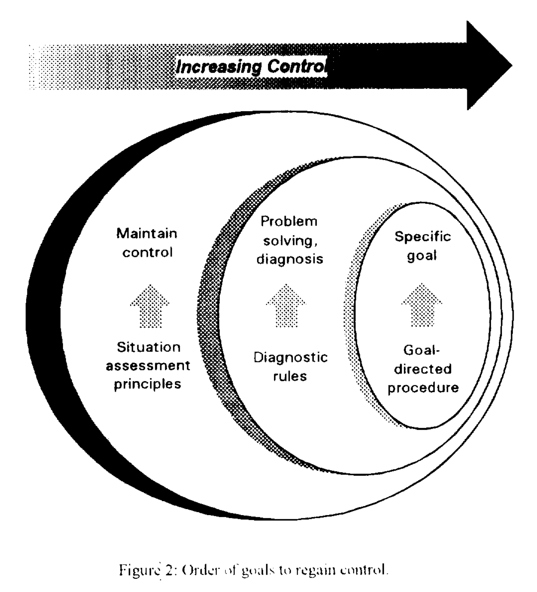

*Kubernetes was a steersman or pilot, and kubernesis is the act of steering*

## Why [operators](https://kubernetes.io/docs/concepts/extend-kubernetes/operator/)?
> Operators are software extensions to Kubernetes that make use of [custom resources](https://kubernetes.io/docs/concepts/extend-kubernetes/api-extension/custom-resources/) to manage applications and their components. Operators follow Kubernetes principles, notably the [control loop](https://kubernetes.io/docs/concepts/architecture/controller). The kubernetes' operator pattern concept lets you extend the cluster's behaviour without modifying the code of Kubernetes itself by linking controllers to one or more custom resources.

Spurred by px.dev's [post about operators](https://blog.px.dev/k8s-operator/) this "blog" speaks to why leveraging operators need not result in [loss of control](https://blog.px.dev/k8s-operator/#loss-of-user-control) or be a [maintenance burden](https://blog.px.dev/k8s-operator/#maintenance-burden) by paraphrasing the contents of "The modelling of loss of control" presented at the proceedings of IEEE Systems Man and Cybernetics Conference - SMC in Le Touquet, France way back in 1993[1]

## Loss of control
To address the concern of the percieved loss of control of operators of software systems lets consider the following models. The traditional sys admin model of operations can roughly be described as a procedural prototype model.  This is in contrast to what could potentially be introduced by software operators and can be described as a contextual control model. 

### Procedural prototype model
A procedural prototype model implicitly expresses the view that a characteristic or pre-defined sequence of actions exists which represents a way of doing things and is usually described in documentation as MoPs, run books etc.

### Contextual control model
A contextual control model implies that actions are determined by the context rather than by any inherent relations between them. It is therefore not possible a priori to describe procedural prototypes or "natural" relations between actions; the choice of the next action at any given point in time is determined by the current context. 

The focus of a contextual control model is therefore not on how the choice of next action is controlled but rather whether certain sequences are more appropriate than others. In simpler terms, this is essentially a shift from an imperative to a declarative way of imposing control on a system. The two views address the same phenomena but do it in a different way emphasising different concepts and relations for descriptions and explanations. 

>Procedural prototype models rely on recurrent patterns of action such as templates or standards. Much effort is therefore spent to check how performance complies with the standards and normative descriptions, procedures, protocols, training, organization structures, etc.
>

>Contextual control models instead look to the factors that produce the recurrent patterns. The recurring patterns or configurations of actions are due to the similarity of conditions or state, rather than to a predefined organization or prototype. 
>

For the purposes of system design and operation it is important to be able to understand both how operators may maintain control and how they may lose it. The paper argues that it is more important to describe the coupling between context and control, rather than the details of human cognition i.e. both knowledge of the system and procedures that need to performed. The example used to illustrate this concept is that of emergency procedures i.e. situtions in which there are limited time and resources to spend on cognition and actions are taken based on pre-learned patterns. Building up from this example the paper argues that building an abstraction based on the contextual control model results in effective control while abstracting away the details of procedures that need to be executed as illustrated by the image below.

  

## Maintenance overhead
There is always overhead to maintain systems. Changing software to implement new features, correct problems, update functions, or replace obsolete components is inevitable in any software system. A systematic software change process is essential for the maintenance and reuse of business-critical software through out the lifecycle of sofware products. Although not akin to a realtime control or emergency situtaion where actions are inevitably derived from prelearned patterns rather than analysis in the moment. A significant amount of the cognitive overhead of implementing changes in a complex system can be offloaded from operations personel and other related tooling by encodeding them a software operator. Operators are able to simplify and automate aspects lifecyle engineering by encoding and delivering processes as software rather in operations personal and external tooling, documentation, procedures, protocols, GitOps, CI/CD etc. Looking at the larger ecosystem of systems and tools involved in managing a software product and relative to all the tooling and people usually involved in such endeavours the operator pattern is meant to reduce the overhead involved in delivering changes to software systems while mainting performance and reliablity.

## Key considerations in operator design
Given that operators are perceived to result in a loss of control as well as in maintenace overhead. These UX characteristics need to be kept in mind when designing operators in order to realize their potential. Operators could be considered a Man-machine interface (or even a Machine-machine interface) that introduce a layer of abstraction on top of a complex system that needs to be controlled or operated. The following points from the paper[1] can be considered during their design.

>MMI design should make it possible to unclutter information, i.e., it should enable the operator to concentrate on what is considered the essential aspects of operating or controlling the system and to maintain a simplified notion of its state ex: list of events (past and future), etc. It should be possible to tailor the system to situational conditions.
>

>Modelling should concentrate on how actions may be chosen in dominant control modes, and how the transition between modes can take place. Knowing what the main parameters of each mode are in terms of an underlying model, makes it possible for an operator (person or system) to develop a proper working model of the system being controlled thus resulting in an enhanced perception of control.
>

## Conclusion
Operators are software components that offload control operations from traditional vectors such as operations personel. It is very much akin to automated driver assist technology. The end user should not feel a loss of control if the operator developer abstracts configuration and actions involved in the operation of an application in an intuitive and predictable way. There is an aspect of "maintenance" burden that is reconfigured to some extent, but this maintenance overhead always existed and is inevtiable in software systems.

[1] E. Hollnagel, "The modelling of loss of control," Proceedings of IEEE Systems Man and Cybernetics Conference - SMC, Le Touquet, France, 1993, pp. 44-49 vol.3, doi: 10.1109/ICSMC.1993.384983.
